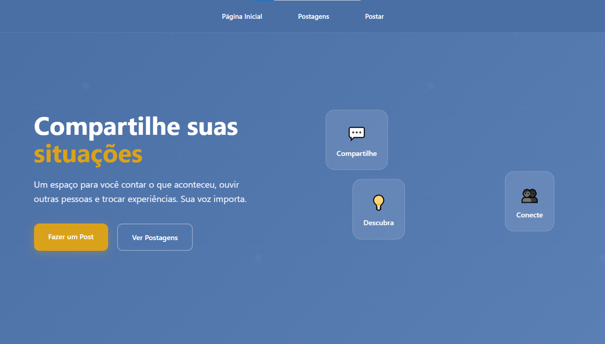
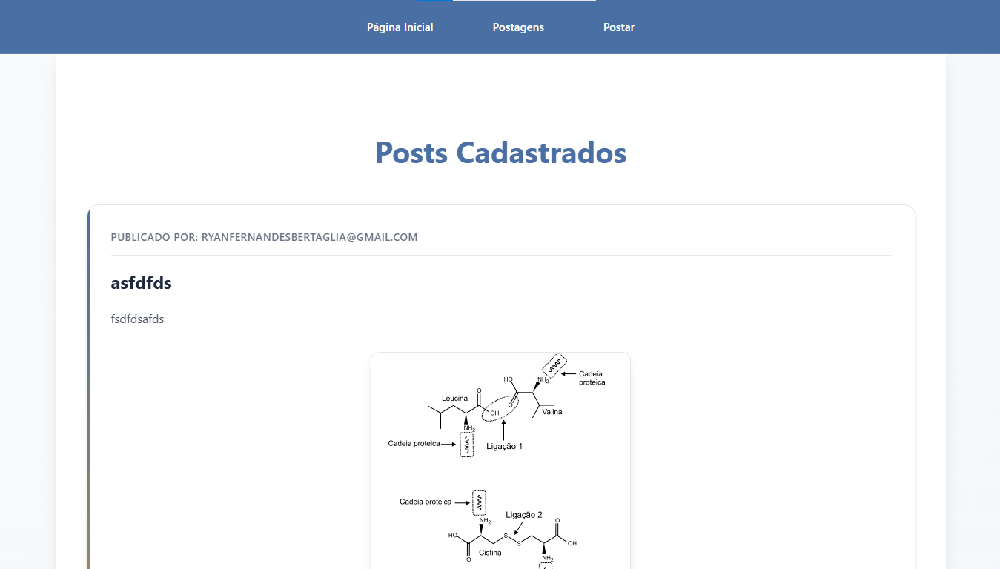
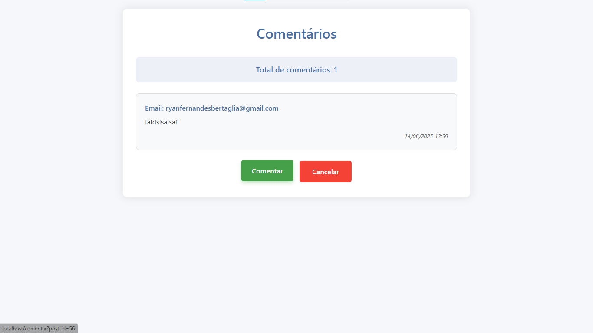

# Auditoria Web - Plataforma de Posts e Comentários

Este projeto é uma aplicação web que permite aos usuários realizar auditorias colaborativas, publicando posts e comentando em posts de outras pessoas. O objetivo é fornecer uma plataforma onde qualquer usuário pode relatar situações, discutir e colaborar na identificação de problemas e soluções.

## 📑 Funcionalidades

- Cadastro de usuários
- Login e autenticação
- Criação de posts
- Comentários em posts de outros usuários
- Visualização de todos os posts e seus respectivos comentários
- Validação de dados no back-end
- Arquitetura organizada no padrão MVC

## 🛠️ Tecnologias

**Back-end:**
- PHP (Padrão MVC)
- MySQL (Banco de dados)

**Front-end:**
- HTML5, CSS3, JavaScript
- Bootstrap 5 (Design responsivo)

**Ferramentas:**
- XAMPP (Ambiente de desenvolvimento)

## 🚀 Instalação e Configuração

### Pré-requisitos
- XAMPP instalado com PHP + MYSQL
- Git

### Passo a Passo

1. **Clonar o repositório:**

```bash
   git clone https://github.com/RyanFBertaglia/Auditoria.git
```
2. Coloque a pasta do projeto dentro do diretório htdocs do XAMPP

3. Abra a página no navegador de configuração do banco de dados: 
```
http://localhost/phpmyadmin/index.php?route=/server/sql
```
4. Crie um banco de dados no MySQL chamado dados
```bash
CREATE DATABASE dados;
```
5. Importe e rode os arquivos SQL da pasta migrations para criar cada tabela

## Design:
### Página inical:

### Ver Posts:

### Criar Posts:

### Comentarios:

### Comentar:


## 🏗️ Arquitetura MVC

|Model	  | Responsável pela conexão com o banco de dados e manipulação dos dados (CRUD)	 |
|-------------------|---------|
| 	         **View** | 	**Responsável pela interface com o usuário (HTML, CSS, JS)**   |
| 	        **Controller** | 	 **Gerencia as requisições, processa os dados através do Model e retorna as Views**  |

